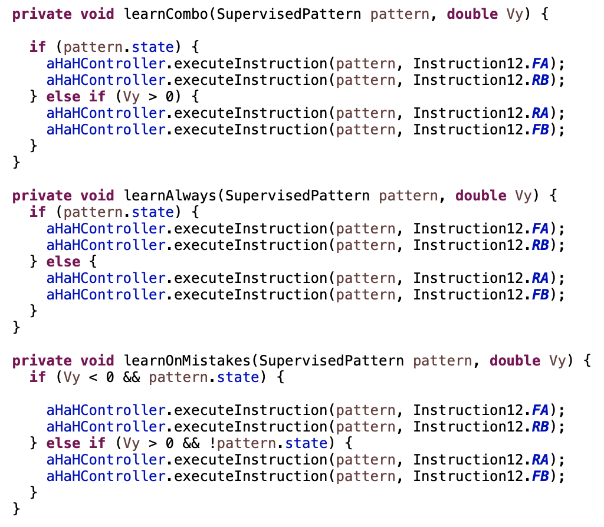

# Classify Experiment

This app performs online supervised classification with an 8 synapse kT-RAM core formed from the 16 memristors of a Knowm 1X16 linear array memristor chip. The top plot displays an exponential moving average of the classification accuracy while the bottom plot displays the measured synaptic states after each training epoch. 

## Mode 2

**The board must be placed into Mode 2 by moving the switch to the right (2) position.** Mode 2 configures the board for differential-pair access as in the following circuit:


## Series Resistors

Two series resistors of equal value must be placed in the A and B resistor sockets. The board is shipped with 20kΩ resistors in each socket. The resistor value must be specified in the preferences 'Series Resistor' field. 

## Controls

The upper control panel can be used to adjust the pulse driver waveform, forward and reverse voltage amplitudes and pulse width. Lower controls select kT-RAM learning routines and datasets. 

## Synaptic Pairings

Each differential pair memristor is created by pairing the following memristors:

Synapse 1: [1,9]
Synapse 2: [2,10]
Synapse 3: [3,11]
Synapse 4: [4,12]
Synapse 5: [5,13]
Synapse 6: [6,14]
Synapse 7: [7,15]
Synapse 8: [8,16] 

### kT-RAM Instruction Routines

This will select the kT-RAM instruction routine (a program which executes kT-RAM instructions) that is used for supervised learning. Instructions are as follows:


Instruction routines are as follows:

  

### Dataset

The dataset defines the learning problem. A dataset is defined as follows:

[0,1,2]:T denotes that the spike pattern formed by activating synapses 1, 2 and 3 leads to a "True" or "Positive" output. F denotes "False" or "Negative" output. Note that patterns listed below are zero indexed while the memristor switches in the upper switch selection control panel are 1-indexed. 

**Ortho2Pattern**

[0, 1, 2, 3]-->T
[4, 5, 6, 7]-->F

**AntiOrtho2Pattern**

[0, 1, 2, 3]-->F
[4, 5, 6, 7]-->T

**Ortho4Pattern**

[0, 1]-->F
[2, 3]-->F
[4, 5]-->T
[6, 7]-->T

**AntiOrtho4Pattern**

[0, 1]-->T
[2, 3]-->T
[4, 5]-->F
[6, 7]-->F

**Ortho8Pattern**

[0]-->T
[1]-->T
[2]-->T
[3]-->T
[4]-->F
[5]-->F
[6]-->F
[7]-->F

**AntiOrtho8Pattern**

[0]-->F
[1]-->F
[2]-->F
[3]-->F
[4]-->T
[5]-->T
[6]-->T
[7]-->T

**TwoEightPattern5Frustrated**

[0, 1]-->T
[1, 2]-->T
[2, 3]-->T
[3, 4]-->T

[4, 5]-->F
[5, 6]-->F
[6, 7]-->F
[7, 8]-->F

**TwoPattern36Frustrated**

[0, 1, 2, 3, 5]-->T
[2,4, 5, 6, 7]-->F


### Train Epochs

The number of times the supervised learning will proceed through the dataset for both the "Scramble" and "Learn" actions.

### Clear Plot

Clears the plot, allowing you to start over.

### Scramble

Applies 4 random two-input spike patterns while executing an Anti-Hebbian instruction, for the given number of train epochs.

### Learn

Uses the selected kT-RAM routine to to learn the selected dataset for the given number of training epochs. An exponential running average of the training accuracy is displayed in the top plot, while the value of each of the 8 synapses after each training epoch is displayed in the bottom plot.

## Exporting Data

Any plot can be right-clicked to export the data in either chart format (save As...) or comma-separated-values (Export As...), which can be opened in spreadsheet software. For "Export As..." a directory needs to be selected. In that directory, an individual CSV file will be created for each series in the plot.

## Preferences

The preferences window allows you to save your preferred experimental control parameters between sessions of using the app.

## Analog Discovery 2 Scope and Waveform Offsets

Some AD2 units have offsets of a few millivolts that can cause significant measurement issues. While waveforms software resolves this through calibration, and while the calibration data is stored on the device itself, the unit does not actually apply the calibration. Rather, Waveforms software uses the stored parameters to correct the acquired data and generated signals. To add calibration to your measurements, follow the below procedure:

1. Remove the Memristor Discovery Board from the AD2.
2. Open the Synapse 1-2 Experiment in Memristor Discovery software.
3. Connect the AD2 1+, 2+, 1- and 2- terminals to ground.
4. Select two memristors (otherwise the software will complain) and hit "start".
5. Open the console by going to Menu Bar--> Window-->Console. Look at the logged messages for V(1+), V(2+) and V(W1). Stop the measurements by clicking on "Stop". Copy the console information. For example:  

```
V(1+): -0.001160290631058606
V(2+): -0.04096653596287886
V(W1): -0.07999999821186066
```
	
6. Connect 1+ and 2+ inputs to W1. You may need a breadboard for this. Click "Start". Look at the logged messages for V(1+), V(2+) and V(W1). Click "Stop". Copy the console information again:

```
V(1+): -0.10088136722427613
V(2+): -0.14046089059718023
V(W1): -0.07999999821186066
```

7. Record scope offsets from measurements in step (5). V(1+) is the Scope (1+) Offset and V(2+) is the Scope (2+) Offset. 
	
```
Scope (1+) Offset: -0.00116
Scope (2+) Offset: -0.04096
```

8. Compute waveform offset from equation using data recorded in step 6 and scope offsets.

```
W1 Offset = V(1+) - [Scope (1+) Offset] - V(W1)

For example: W1 Offset = -0.101 - (-0.001) - (-.08) = -.02
```
	
9. Open the experiment preferences (Menu --> Window --> Preferences) and enter the measured offsets into the preferences. 

10. Restart the experiment. The calibration information will now be used for measurements. 
